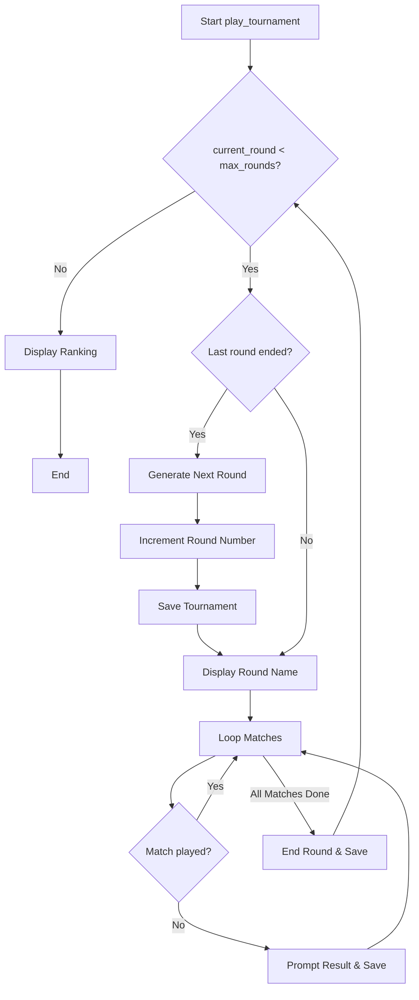

# Tournament Play Flowchart

```mermaid
graph TD
    A[Start play_tournament] --> B{current_round < max_rounds?}
    B -- No --> K[Display Ranking]
    K --> L[End]
    B -- Yes --> C{Last round ended?}
    C -- Yes --> D[Generate Next Round]
    D --> E[Increment Round Number]
    E --> F[Save Tournament]
    F --> G[Display Round Name]
    C -- No --> G
    G --> H[Loop Matches]
    H --> I{Match played?}
    I -- Yes --> H
    I -- No --> J[Prompt Result & Save]
    J --> H
    H -- All Matches Done --> M[End Round & Save]
    M --> B
```
