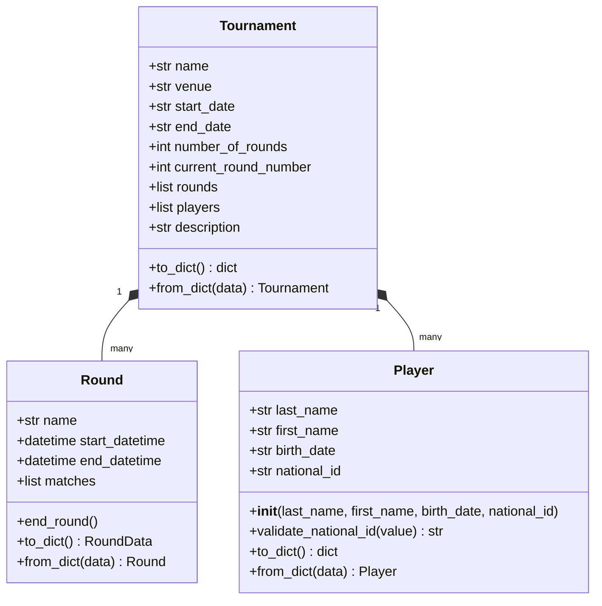

# Modèles UML - Gestionnaire de Tournoi d'Échecs

```mermaid
classDiagram
    class Player {
        +str last_name
        +str first_name
        +str birth_date
        +str national_id
        +__init__(last_name, first_name, birth_date, national_id)
        +validate_national_id(value) str
        +to_dict() dict
        +from_dict(data) Player
    }

    class Round {
        +str name
        +datetime start_datetime
        +datetime end_datetime
        +list matches
        +end_round()
        +to_dict() RoundData
        +from_dict(data) Round
    }

    class Tournament {
        +str name
        +str venue
        +str start_date
        +str end_date
        +int number_of_rounds
        +int current_round_number
        +list rounds
        +list players
        +str description
        +to_dict() dict
        +from_dict(data) Tournament
    }

    Tournament "1" *-- "many" Round
    Tournament "1" *-- "many" Player
```
