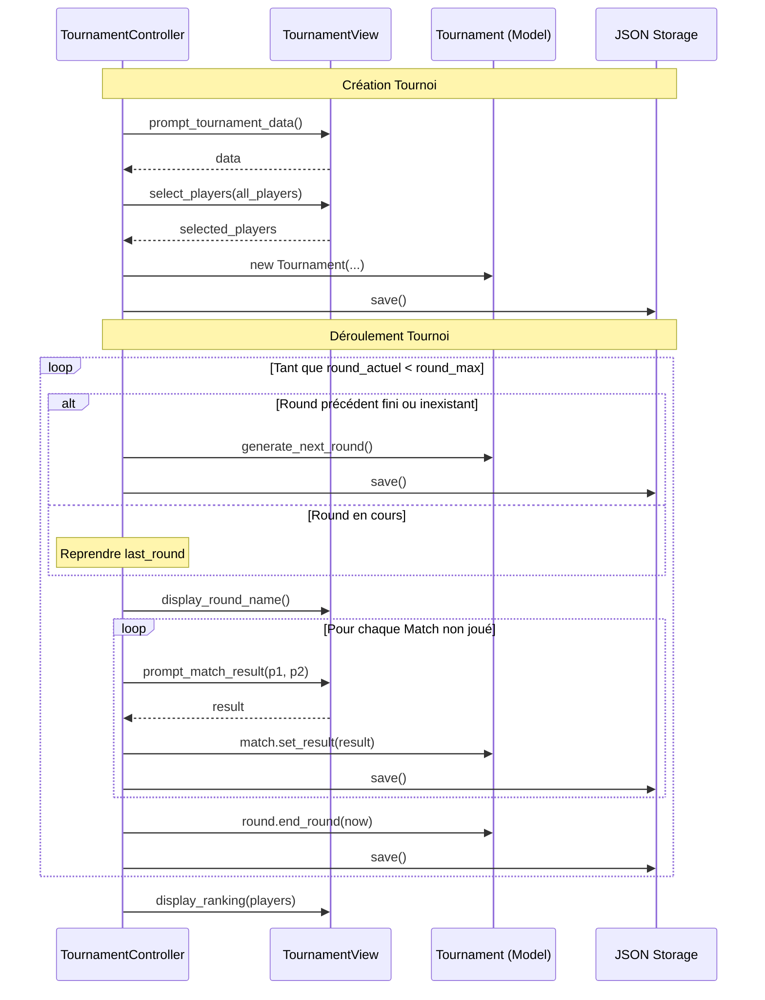

# Sequence Diagram

```mermaid
sequenceDiagram
    participant C as TournamentController
    participant V as TournamentView
    participant M as Tournament (Model)
    participant DB as JSON Storage

    Note over C, DB: Création Tournoi
    C->>V: prompt_tournament_data()
    V-->>C: data
    C->>V: select_players(all_players)
    V-->>C: selected_players
    C->>M: new Tournament(...)
    C->>DB: save()

    Note over C, DB: Déroulement Tournoi
    loop Tant que round_actuel < round_max
        alt Round précédent fini ou inexistant
            C->>M: generate_next_round()
            C->>DB: save()
        else Round en cours
            Note over C: Reprendre last_round
        end

        C->>V: display_round_name()
        loop Pour chaque Match non joué
            C->>V: prompt_match_result(p1, p2)
            V-->>C: result
            C->>M: match.set_result(result)
            C->>DB: save()
        end
        C->>M: round.end_round(now)
        C->>DB: save()
    end
    C->>V: display_ranking(players)
```
