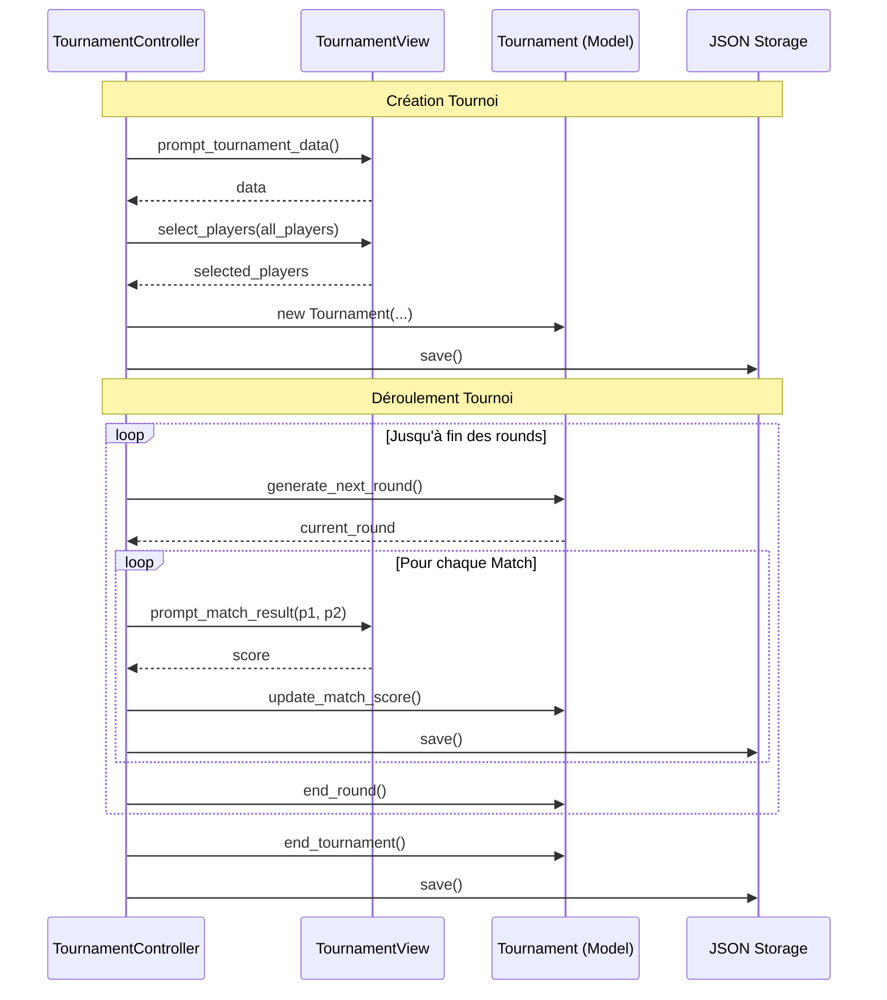

# Tournament Logic Diagram

```mermaid
sequenceDiagram
    participant C as TournamentController
    participant V as TournamentView
    participant M as Tournament (Model)
    participant DB as JSON Storage

    Note over C, DB: Création Tournoi
    C->>V: prompt_tournament_data()
    V-->>C: data
    C->>V: select_players(all_players)
    V-->>C: selected_players
    C->>M: new Tournament(...)
    C->>DB: save()

    Note over C, DB: Déroulement Tournoi
    loop Jusqu'à fin des rounds
        C->>M: generate_next_round()
        M-->>C: current_round
        loop Pour chaque Match
            C->>V: prompt_match_result(p1, p2)
            V-->>C: score
            C->>M: update_match_score()
            C->>DB: save()
        end
        C->>M: end_round()
    end
    C->>M: end_tournament()
    C->>DB: save()
```
